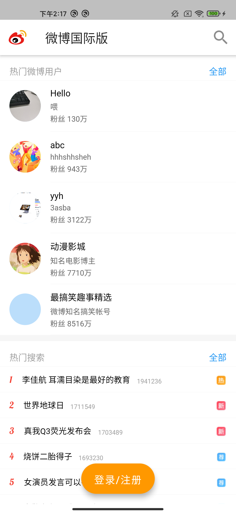
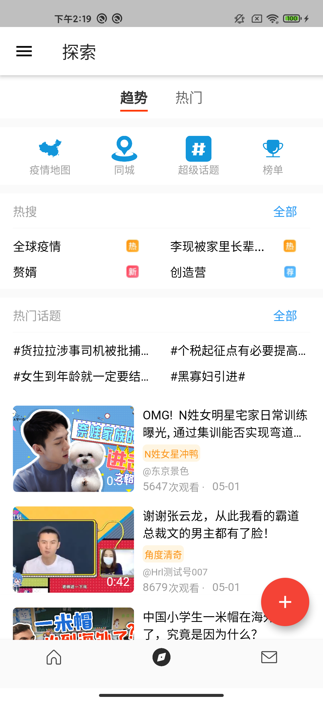
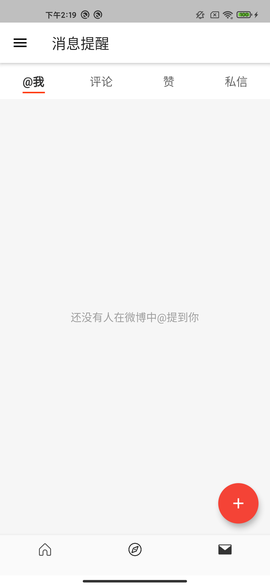
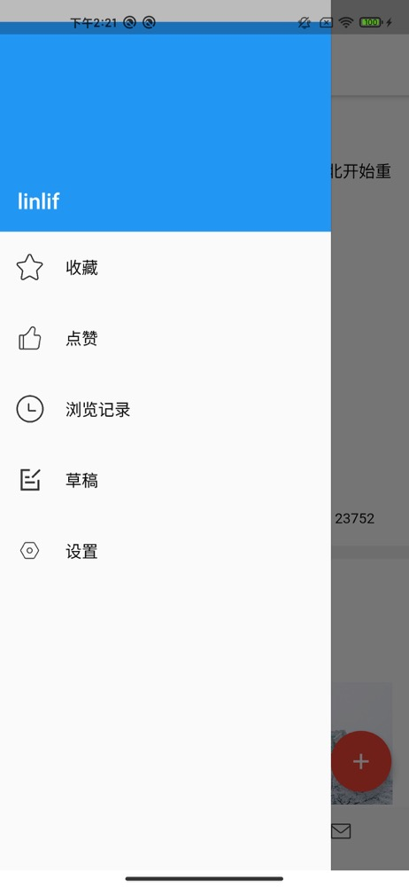

# weibo_international_flutter

用 flutter 编写的仿微博国际版客户端，可以运行在Android 和 ios设备

主要实现了APP的一级页面

启动登录页：

首页：

发现页：

消息页：

侧边栏：

接口地址数据使用了 [flutter_hrlweibo]( https://github.com/huangruiLearn/flutter_hrlweibo) 工程的内容
